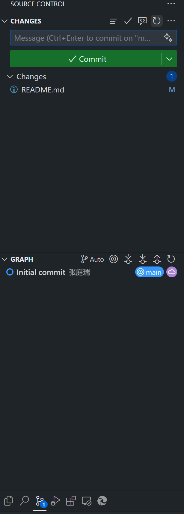

# 开发指南

为确保大家顺利地参与开发、提交代码和保持良好的协作流程，请务必阅读以下说明。

---

## 🔧 环境准备

### 1. 安装 Git

#### Windows
1. 访问 [Git 官网](https://git-scm.com/download/win) 下载并安装。
2. 安装时一路默认即可，推荐使用 Git Bash 作为命令行工具。

## 🧩 Git 配置（首次使用）

打开终端（Terminal 或 Git Bash），执行以下命令设置用户名和邮箱：

```bash
git config --global user.name "你的名字"
git config --global user.email "你的邮箱"
```

⚠️ 这两个值将出现在你的提交记录中。邮箱和github账号使用的相同。

---

## 🗃️ 克隆项目（首次下载项目）

```bash
git https://github.com/HelloWorldZTR/Vocabual.git
cd Vocabual
code .
```

或在 VS Code 中使用 `Ctrl + Shift + P` → 输入 `Git: Clone` → 粘贴仓库地址。

---

## 🔄 日常工作流程

请**不要直接在主分支 `main` 上开发**，每个人请使用**独立分支**进行开发。

### 1. 同步远程代码（每次开发前）

在终端中执行：

```bash
git pull origin main
```

或者在 VS Code 左侧源代码管理面板中点击“刷新”按钮。



### 2. 创建并切换到新分支

在终端中执行：

```bash
git checkout -b your-name/feature-name
```

也可以在 VS Code 左下角点击当前分支名 → 输入新分支名并回车。


---

## ✍️ 在 VS Code 中提交和推送修改

### 1. 打开 Git 面板


点击左侧活动栏中的 **源代码管理图标**（看起来像个 Y 字），或者使用快捷键：

```
Ctrl + Shift + G 
```

### 2. 查看修改文件

已修改的文件会显示在列表中。你可以右键 → `暂存更改`，或者点击文件名前的 `+` 图标。

### 3. 输入提交信息

在上方的“消息”框中写下本次提交的说明，例如：

```
添加登录组件
```

然后点击 ✓ 按钮进行提交。

### 4. 推送到远程分支

点击右上角的三点菜单 `...` → 选择 `Push`（推送）。  
首次推送新分支时，可能需要选择 `Push to...` → 远程分支名。

---

## 🧼 常见问题

### pull 失败或有冲突怎么办？

```bash
git stash          # 保存你的修改
git pull origin main
git stash pop      # 重新应用修改
```

如有冲突，手动修改冲突文件后重新提交即可。

---

## 🔐 可选：配置 SSH Key（避免每次输入密码）

1. 生成 SSH Key：

```bash
ssh-keygen -t ed25519 -C "你的邮箱"
```

2. 添加公钥到 GitHub：

```bash
cat ~/.ssh/id_ed25519.pub
```

复制输出内容，在 GitHub → Settings → SSH and GPG Keys 中添加。

---

## 📎 小贴士

- 每次开发前使用 `git pull` 或 VS Code 同步一下，避免冲突。
- 每次提交写清楚本次更改的内容，方便团队协作。
- 使用统一的分支命名格式，如 `your-name/feature-name`。
- 不要直接 push 到 main，先checkout branch,再在自己的brach开发

---
